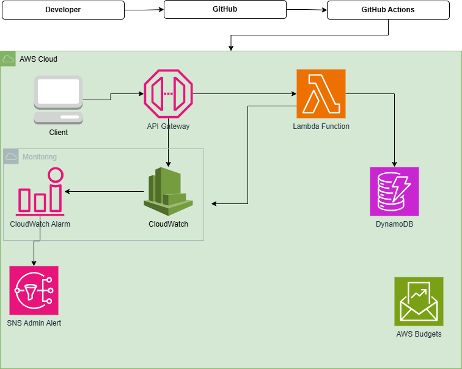

# AWS Serverless Event Registration & Ticketing System
## Project Overview

The Event Registration & Ticketing System is a serverless application designed to replace a manual event registration process that relied on Microsoft Forms and Excel spreadsheets. The solution leverages AWS managed services to provide a scalable, secure, and cost-effective REST API for managing events and attendee registrations.

The application enables event organizers to create and manage events while allowing attendees to register online and receive automated confirmation emails. By adopting a serverless architecture, the system eliminates server management, automatically scales with demand, and minimizes operational costs.

## Problem

An event management organization was managing growing registration volumes through Microsoft Forms and Excel spreadsheets. This created:

No automated attendee confirmation emails
No real-time visibility into system health or errors
No structured, repeatable deployment process
No way to enforce spend limits or track cost against a free-tier budget

This project replaces that manual workflow with a serverless REST API that scales automatically, confirms registrations by email, tracks its own cost, and deploys through a CI/CD pipeline.

## Architecture overview 


A developer pushes code to GitHub, triggering GitHub Actions to build, test, and deploy to AWS.

A client request hits API Gateway, which invokes Lambda to validate input and write to DynamoDB (`Events`, `Registrations`). On success, Lambda publishes to SNS, sending the attendee a confirmation email.

CloudWatch collects logs/metrics from API Gateway and Lambda; alarms trigger a separate SNS alert to admins on errors or throttling. AWS Budgets tracks spend independently and alerts as free-tier limits approach. IAM roles enforce least-privilege access across every service.


| Service | Role |
|---|---|
| **API Gateway** | Exposes REST endpoints for event creation, registration, and lookup |
| **Lambda** | Stateless business logic — validates input, writes to DynamoDB, publishes to SNS |
| **DynamoDB** | Stores `Events` and `Registrations` tables, on-demand billing to fit free-tier usage |
| **SNS** *(optional)* | Sends attendee confirmation emails on successful registration |
| **CloudWatch** | Collects logs/metrics from API Gateway and Lambda; alarms on errors or throttling |
| **AWS Budgets** | Tracks spend and alerts before the free tier is exceeded |
| **GitHub Actions** | Runs tests and deploys infrastructure/code on every push to `main` |
| **IAM** | Least-privilege roles scoped per Lambda function and service boundary |

## Frontend Stack
The client is a single-page app built with **React** and **Vite**, giving the operations team and attendees a browser-based interface to replace the old Microsoft Forms workflow.
 
- **React** – component-based UI for browsing events, viewing details, and submitting registrations
- **Vite** – fast dev server and build tooling for the frontend
- Communicates with the backend entirely through the **API Gateway** REST endpoints (`/events`, `/events/{eventId}/register`, etc.)
- Deployed as a static site on **S3**, keeping the whole stack within the AWS free tier


## Features
 
- REST API for creating events and registering attendees
- Automatic email confirmation on successful registration
- Centralized logging and alarms for API/Lambda errors
- Budget alerts before any charges are incurred
- One-command deployment via GitHub Actions
- Infrastructure defined as code (Terraform / AWS SAM )

## Project structure 

```


```


## API endpoints
 
| Method | Path | Description |
|---|---|---|
| `POST` | `/events` | Create a new event |
| `GET` | `/events/{eventId}` | Get event details |
| `POST` | `/events/{eventId}/register` | Register an attendee |
| `GET` | `/events/{eventId}/registrations` | List registrations for an event |
 
## Getting started
 
### Prerequisites
 
- AWS account (free tier)
- AWS CLI configured locally
- Node.js (or your chosen Lambda runtime)
- Terraform 
- An AWS OIDC identity provider configured for GitHub Actions (for CI/CD deploys)
- Python

### Clone Repo
```bash
git clone https://github.com/amoako-franque/AWS-Serverless-Event-Registration-Ticketing-System.git
cd AWS-Serverless-Event-Registration-Ticketing-System
 
```

 
### Backend setup
 
```bash
# install dependencies
npm install
 
# run unit tests
npm test
```
 
### Deploy infrastructure
 
```bash
cd infra
terraform init
terraform apply
```
 
### Frontend setup
 
```bash
cd frontend
npm install
npm run dev
```

## CI/CD pipeline
 
Every push to `main` triggers a GitHub Actions workflow that:
 
1. Installs dependencies and runs unit tests
2. Lints and validates the IaC templates
3. Deploys the Lambda functions, API Gateway, and DynamoDB tables to AWS
4. Runs a smoke test against the deployed API


## Cost tracking
 
This project is designed to run entirely within the AWS free tier:
 
- DynamoDB on-demand billing avoids idle capacity charges
- Lambda and API Gateway free-tier limits comfortably cover low/moderate registration volume
- AWS Budgets is configured to alert at 50%, 80%, and 100% of a defined monthly threshold
- Budget alerts are sent through SNS to the project owner's email

## Team
 
**Group name:** Hypervisor
 
**Members:**
- Richard Vidzrakou
- Freda Kemphrey
- Hassanatu Ahmed
- Humaidu Ali Mohammed
- Frank Amoah Boafo
- Joel Addition

**Mentor:** William Mukoyani

## License
 
MIT