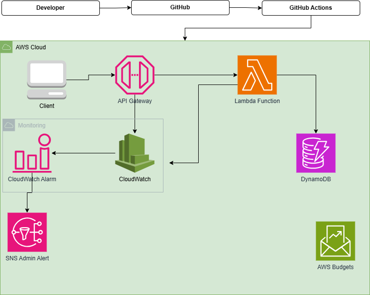

# AWS Serverless Event Registration & Ticketing System

A serverless event registration platform that replaces manual form-based workflows with an automated, scalable, and cost-conscious AWS solution. The system supports event creation, attendee registration, cancellation, and operational monitoring while staying within a practical free-tier-friendly architecture.

## Why this project exists

The original workflow relied on Microsoft Forms and spreadsheets, which made it difficult to:

- confirm registrations automatically
- track attendance consistently
- monitor failures and costs in real time
- deploy changes in a repeatable way

This repository replaces that manual process with a serverless REST API, infrastructure as code, and deployment automation.

## What the system does

- allows organizers to manage events
- lets attendees register and cancel registrations
- sends confirmation workflows through AWS messaging services
- collects logs, alarms, and budget alerts for operational visibility
- deploys through Terraform and GitHub Actions for repeatable delivery

## Architecture at a glance



The flow is straightforward:

1. A developer pushes code to GitHub.
2. CI/CD validates and deploys the backend and infrastructure to AWS.
3. API Gateway routes requests to Lambda functions.
4. Lambda handlers validate input and interact with DynamoDB.
5. CloudWatch, SNS, and AWS Budgets provide monitoring and cost controls.

| Service | Role |
|---|---|
| API Gateway | Exposes event and registration endpoints |
| Lambda | Hosts the business logic for registration workflows |
| DynamoDB | Stores event and registration data |
| SNS | Supports notifications and confirmation flows |
| CloudWatch | Tracks logs, metrics, and alarms |
| AWS Budgets | Helps prevent unexpected cloud spend |
| GitHub Actions | Runs tests and deploys the solution |

## Documentation

The repository is split into focused docs for each area of the project:

- [Backend API contract](backend/API.md)
- [Backend implementation guide](backend/BACKEND_DOC.md)
- [System architecture overview](docs/architecture.md)
- [Deployment guide](docs/deployment.md)
- [Frontend notes](frontend/FRONEND_DOC.md)

## Project structure

```text
AWS-Serverless-Event-Registration-Ticketing-System/
├── backend/
│   ├── lambda/
│   ├── scripts/
│   ├── tests/
│   ├── API.md
│   ├── BACKEND_DOC.md
│   └── requirements*.txt
├── docs/
│   └── images/
├── frontend/
├── terraform/
└── README.md
```

## Key features

- REST API for event management and attendee registration
- Automated confirmation-style notifications
- Centralized monitoring and alerting
- Cost controls with AWS Budgets
- Infrastructure defined as code with Terraform
- CI/CD deployment workflow for repeatable releases

## Getting started

### Prerequisites

- AWS account
- AWS CLI configured locally
- Terraform installed
- Python 3.x
- Git

### 1. Clone the repository

```bash
git clone https://github.com/amoako-franque/AWS-Serverless-Event-Registration-Ticketing-System.git
cd AWS-Serverless-Event-Registration-Ticketing-System
```

### 2. Set up the backend locally

```bash
cd backend
pip install -r requirements.txt -r requirements-dev.txt
pytest tests -v
```

### 3. Deploy the infrastructure

```bash
cd terraform
terraform init
terraform plan
terraform apply
```

### 4. Review the supporting docs

Use the linked documentation above for API contracts, deployment steps, architecture decisions, and frontend guidance.

## CI/CD and operations

Every push to the main branch can trigger automated validation and deployment workflows. The deployment process is described in [docs/deployment.md](docs/deployment.md), and the backend runtime behavior is documented in [backend/BACKEND_DOC.md](backend/BACKEND_DOC.md).

## Cost and reliability considerations

The design favors low operational overhead and clear visibility:

- DynamoDB on-demand billing helps avoid over-provisioning
- Lambda and API Gateway support a lightweight serverless footprint
- monitoring and budgets provide early signals for errors or spend

## Team

Group name: Hypervisor

Members:
- Richard Vidzrakou
- Freda Kemphrey
- Hassanatu Ahmed
- Humaidu Ali Mohammed
- Frank Amoah Boafo
- Joel Addition

Mentor: William Mukoyani

## License

MIT